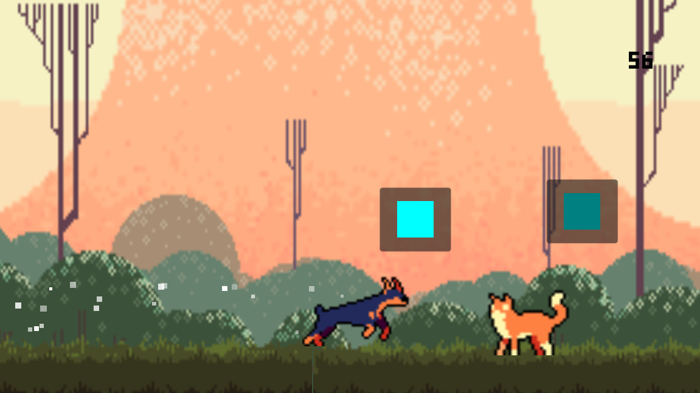

# Ikadev2
test answer for ikadev

preview of the application:  
  

as for this project, most of the code pattern is inspired by c# programming  
it is highly subjective but I think c# programming is ellegant.  

for this project follows MVP pattern where the model may obtain their data from various sources.  
for the game scene, models obtain their data from GameData.gd  
while presenters and views are strictly presentational  